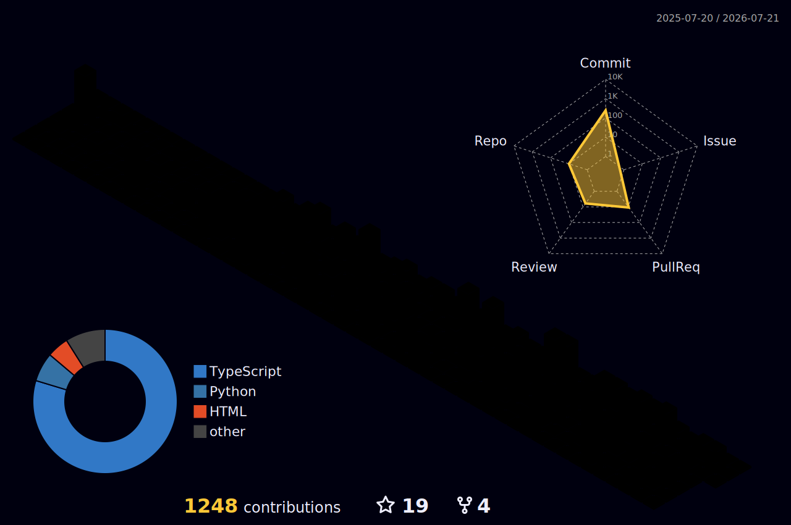

  <b>🌍 Langues :</b>
  <a href="README.md">🇬🇧 English</a> |
  <a href="README.fr.md">🇫🇷 Français</a>

  <h1 style="font-size: 2.5rem; color: #333; margin-bottom: 10px;">Bonjour 🌅 !</h1>
  
  
<b>Je suis Mathis Zerbib, développeur full-stack web et mobile originaire de Montpellier, dans le sud de la France 🇫🇷.</b>

  [-0A66C2?style=for-the-badge&logo=google-drive&logoColor=white)](https://drive.google.com/file/d/1quqnNm2kWQKDBHwhC_mTEjLiz0DVV1OL/view?usp=sharing)
  

---

<h2 align="center">🚀 Startups & Plateformes à la Une</h2>

<table align="center" width="100%">
  <tr>
    <td align="center" width="50%">
      <h3>🍃 KanaClear</h3>
      
KanaClear est une plateforme SaaS de sevrage haute performance développée avec Supabase et Postgres. Elle remplace les "resets" binaires par un score de résilience scientifique, suivant la normalisation des récepteurs CB1 et l'épargne à la milliseconde via un écosystème évolutif de "Forêt Intérieure".

      <em>SaaS • Supabase • Postgres</em>  
      
    </td>
    <td align="center" width="50%">
      <h3>🚁 ZoneVol</h3>
      
ZoneVol est une plateforme aéronautique unifiée pour les télépilotes de drones, centralisant les réglementations de la DGAC, les prévisions météo en temps réel et la planification de missions via une interface cartographique intuitive. L'application transforme la conformité réglementaire complexe en un flux de travail fluide pour professionnels et amateurs.

      <em>Aéronautique • Cartographie • Intégration API</em>  
      
    </td>
  </tr>
</table>

---

<h2 align="center">💻 Projets Populaires & Clients</h2>

<table align="center" width="100%">
  <tr>
    <td align="center" width="50%">
      <h3>Portfolio de Mathis Zerbib</h3>
      
Mon site web personnel présentant mon travail, mes compétences et mes projets en tant que développeur full-stack.

      
    </td>
    <td align="center" width="50%">
      <h3>Interface Asso</h3>
      
Un site vitrine professionnel pour l'association Interface, construit avec des technologies web modernes.

      
    </td>
  </tr>
  <tr>
    <td align="center" width="50%">
      <h3>Maestoso Productions</h3>
      
Site web d'une société de production présentant des services créatifs et du contenu multimédia.

      
    </td>
    <td align="center" width="50%">
      <h3>Couple View</h3>
      
Une application de "watch party" avec WebRTC en peer-to-peer pour des expériences de visionnage synchronisées.

      
    </td>
  </tr>
</table>

---

<h2 align="center">🔬 Open Source & Projets Labo</h2>

<table align="center" width="100%">
  <tr>
    <td align="center" width="33%">
      <h3>ViNotes</h3>
      
Carnet de dégustation de vin avec reconnaissance IA pour scanner les étiquettes et gérer sa cave.

      
    </td>
    <td align="center" width="33%">
      <h3>Geospatial Algorithm Lab</h3>
      
Visualisation d'algorithmes (Dijkstra, A*, etc.) avec l'intégration d'OpenStreetMap.

      
    </td>
    <td align="center" width="33%">
      <h3>Techno Morphosis</h3>
      
Un outil de visualisation interactive pour explorer l'évolution technologique.

      
    </td>
  </tr>
</table>

---

<h2 align="center">⚡ Langages & Frameworks</h2>

  **Langages** 
  
  
  
  
  
  

    

  **Frameworks Frontend** 
  
  
  
  
  
  

    

  **Backend & Bases de Données** 
  
  
  
  
  

    

  **DevOps & Outils** 
  
  
  
  
  

---

<h2 align="center">📈 Activité & Statistiques GitHub</h2>

  
Présentation de mon activité quotidienne et des dépôts sur lesquels je travaille actuellement.

  
  

    

  

    

  <h3>Amélioration du Profil GitHub</h3>
  
Message de bienvenue dynamique et animation du jeu du serpent générés via GitHub Actions :

  
  

    
  

### Mon Calendrier de Contributions GitHub 3D

---

  <h2>📫 Contactez-moi</h2>
  
N'hésitez pas à me contacter pour des collaborations, innovons ensemble !

  
  
  

    
  

