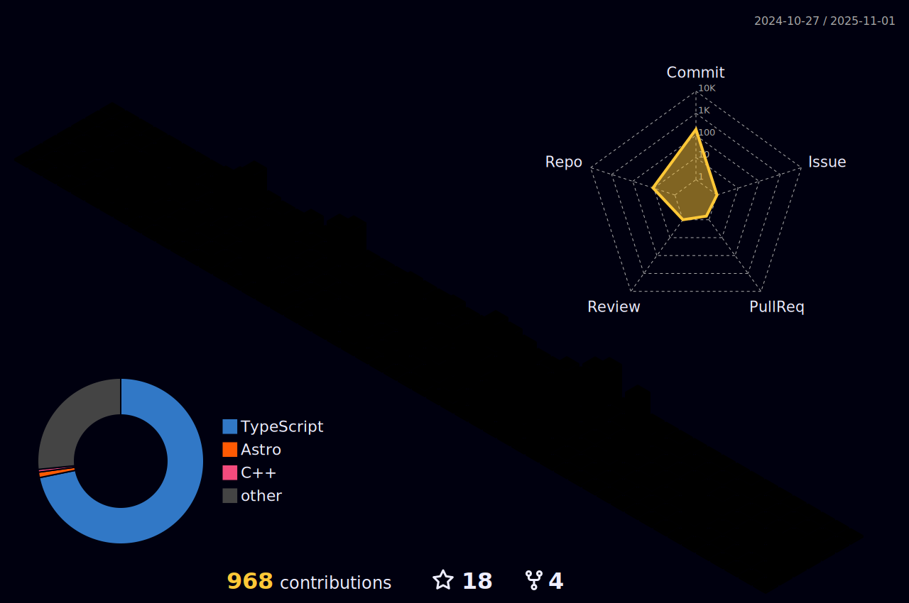

<div align="center" style="margin: 20px 0;">
 <h2 style="font-size: 2rem; color: #333; margin-bottom: 10px;">Good evening 🌇!</h2>
</div>

<div align="center">
 <br clear="both">
 
<br clear="both">
    <p>I am Mathis Zerbib, mobile and web full-stack developer hailing from Montpellier, located in the southern region of France 🇫🇷.</p>
</div>

<br clear="both">

<h2 align="center" class="section-heading">My resume (FR)</h2>

<div align="center" style="margin-bottom: 20px;">

[](https://drive.google.com/file/d/1quqnNm2kWQKDBHwhC_mTEjLiz0DVV1OL/view?usp=sharing)

</div>

<br clear="both">


<h1 align="center">Popular Project</h1>

<table align="center">
  <tr>
    <td align="center">
      <h3>Next.js SaaS Template</h3>
      <p>A complete, production-ready SaaS starter built with Next.js 14, Auth.js, Stripe, Prisma, and more.</p>
      <a href="https://madev.xyz" target="_blank">
        
      </a>
    </td>
    <td align="center">
      <h3>Talent Scout</h3>
<p>Discover top developer talent, engage with open source projects, and leverage AI-driven insights to build your dream team.</p>
      <a href="https://talent.scout.madev.xyz" target="_blank" rel="noopener noreferrer">
        
      </a>
    </td>
  </tr>
</table>
<br clear="both">
<h1 align="center">My Open Source Projects</h1>
<table align="center">
 <tr>
    <td align="center">
      <h3>RepoSpark</h3>
      <p>AI-powered GitHub repository analyzer that provides insights and summaries about any public repository.</p>
      <a href="https://github-repo-ai.vercel.app/" target="_blank">
        
      </a>
    </td>

  <td align="center">
      <h3>Sleek Quote Craft</h3>
      <p>A quote maker using IndexedDB for fast and glazed quotes in English and French.</p>
      <a href="https://sleek-quote-craft.vercel.app/" target="_blank">
        
      </a>
    </td>
 </tr>
  <tr>
    <td align="center">
      <h3>Instagram Reels Cost Calculator</h3>
      <p>An interactive tool to estimate the cost of creating Instagram Reels based on various factors.</p>
      <a href="https://mathiszerbib.github.io/calculateur-reels-instagram/" target="_blank">
        
      </a>
    </td>
    <td align="center">
      <h3>Public Secret Santa Wishlist</h3>
      <p>A platform for communities to effortlessly add, search for, and track the status of all their Secret Santa gifts.</p>
      <a href="https://secret-santa-wishlist.vercel.app/" target="_blank">
        
      </a>
    </td>
  </tr>
  <tr>
    <td align="center">
      <h3>AE French Tax Calculator</h3>
      <p>A tool to calculate French taxes based on various factors.</p>
      <a href="https://ae-french-tax.vercel.app" target="_blank">
        
      </a>
    </td>
    <td align="center">
      <h3>Public Camelot Wheel</h3>
      <p>A visual representation of the Camelot Wheel for music key relationships.</p>
      <a href="https://camelot-wheel-sigma.vercel.app" target="_blank">
        
      </a>
    </td>
  </tr>
  <tr>
    <td align="center">
      <h3>Bitcoin HODL App</h3>
      <p>A tool to visualize and track Bitcoin holdings over time.</p>
      <a href="https://btc-hodl-app.vercel.app/" target="_blank">
        
      </a>
    </td>
    <td align="center">
      <h3>BTC Sentiment Signal</h3>
      <p>A web app built with Vite and CoinGecko to analyze Bitcoin sentiment and gather technical info for DCA decisions.</p>
      <a href="https://btc-sentiment-signal.vercel.app" target="_blank">
        
      </a>
    </td>
  </tr>
  <tr>
    <td align="center">
      <h3>Auto Ursaff</h3>
      <p>A web app to track declared income in French taxes, built with the Ursaff API.</p>
      <a href="https://auto-ursaff.vercel.app/" target="_blank">
        
      </a>
    </td>
  </tr>
</table>

<br clear="both">
<br clear="both">
<h2 align="center" class="section-heading">Languages & Frameworks</h2>
<br clear="both">

<div align="center">

  <!-- LANGAGES -->
  <h3>Langages</h3>
  
  
  
  
  
  
  
  

  <br><br>

  <!-- FRAMEWORKS & TECHNOLOGIES -->
  <h3>Frameworks & Technologies</h3>
  
  
  
  
  
  
  

  <br clear="both"><br>

  <!-- BACKEND -->
  <h3>Backend</h3>
  
  
  
  
  
  

  <br><br>

  <!-- BASES DE DONNÉES -->
  <h3>Database</h3>
  
  
  

  <br><br>

  <!-- DEVOPS & OUTILS -->
  <h3>DevOps & Tools</h3>
  
  
  
  
  
  
  
  
  
  

</div>


<br clear="both">
<br clear="both">

<div align="center">
<h2 align="center" class="section-heading">Let's Connect</h2>

Feel free to reach out for collaborations, let's innovate together! </p>
<div align="center">
  <a href="https://discord.com/users/564153086201823232" target="_blank">
    
  </a>
  <a href="mailto:mathis.zerbib@gmail.com" target="_blank">
    
  </a>
  <a href="https://www.linkedin.com/in/mathis-zerbib-55b4a8163/" target="_blank">
    
  </a>
 <br clear="both">
  <br clear="both">
 
<p>
  Checkout my website (WIP)
  <div style="clear: both;"></div>
  <a href="https://mathis-zerbib.com">https://mathis-zerbib.com</a>
</p>
<br clear="both">

</div>

<br clear="both">
<br clear="both">

<div align="center">
 
   <h2>Github Commits</h2>
    <p>This section highlights my daily activity, showcasing the repositories I am currently working on. </p>
<br clear="both">

<div align="center">

  
 
</div>
<br clear="both">

<div align="center">
     
</div>

<br clear="both">

<br clear="both">

<div align="center">
   <h3>GitHub Profile Enhancement</h3>
   <p>I've implemented a little snake animation and a dynamic welcome message using GitHub Actions. You can find more under:</p>
   <a href="https://github.com/MathisZerbib/MathisZerbib/tree/main/.github/workflows" target="_blank">
       
   </a>
   <a href="https://github.com/MathisZerbib/MathisZerbib/tree/main/.github/scripts" target="_blank">
       
   </a>


</div>

<!-- skyline start -->
```text
 _____ _                 _           __                                     
|_   _| |__   __ _ _ __ | | _____   / _| ___  _ __   _   _  ___  _   _ _ __ 
  | | | '_ \ / _` | '_ \| |/ / __| | |_ / _ \| '__| | | | |/ _ \| | | | '__|
  | | | | | | (_| | | | |   <\__ \ |  _| (_) | |    | |_| | (_) | |_| | |   
  |_| |_| |_|\__,_|_| |_|_|\_\___/ |_|  \___/|_|     \__, |\___/ \__,_|_|   
                                                     |___/                  
 _       _                     _       _                                       
(_)_ __ | |_ ___ _ __ ___  ___| |_    | |__   ___ _ __ ___   _   _  ___  _   _ 
| | '_ \| __/ _ \ '__/ _ \/ __| __|   | '_ \ / _ \ '__/ _ \ | | | |/ _ \| | | |
| | | | | ||  __/ | |  __/\__ \ |_ _  | | | |  __/ | |  __/ | |_| | (_) | |_| |
|_|_| |_|\__\___|_|  \___||___/\__( ) |_| |_|\___|_|  \___|  \__, |\___/ \__,_|
                                  |/                         |___/             
                                                   
  ___ __ _ _ __    ___  ___  ___   _ __ ___  _   _ 
 / __/ _` | '_ \  / __|/ _ \/ _ \ | '_ ` _ \| | | |
| (_| (_| | | | | \__ \  __/  __/ | | | | | | |_| |
 \___\__,_|_| |_| |___/\___|\___| |_| |_| |_|\__, |
                                             |___/ 
       _ _   _           _           _          _ _            
  __ _(_) |_| |__  _   _| |__    ___| | ___   _| (_)_ __   ___ 
 / _` | | __| '_ \| | | | '_ \  / __| |/ / | | | | | '_ \ / _ \
| (_| | | |_| | | | |_| | |_) | \__ \   <| |_| | | | | | |  __/
 \__, |_|\__|_| |_|\__,_|_.__/  |___/_|\_\\__, |_|_|_| |_|\___|
 |___/                                    |___/                
  __                       _           _                           
 / _|_ __ ___  _ __ ___   | | __ _ ___| |_   _   _  ___  __ _ _ __ 
| |_| '__/ _ \| '_ ` _ \  | |/ _` / __| __| | | | |/ _ \/ _` | '__|
|  _| | | (_) | | | | | | | | (_| \__ \ |_  | |_| |  __/ (_| | |   
|_| |_|  \___/|_| |_| |_| |_|\__,_|___/\__|  \__, |\___|\__,_|_|   
                                             |___/                 

                      ╻                              
      ╻          ╻  ╻┃░╻                ╻       ╻    
   ╻╻╻░         ╻░  ░▒░░              ╻╻░       ░╻   
  ╻░░░░╻╻  ╻╻  ╻░░╻ ░░░░╻ ╻╻         ╻░░░       ░░╻  
 ╻░░░░░░░╻ ░░  ░░░░╻░░░░░ ░░         ░░░░       ░░░╻ 
 ░░░░░░░░░ ░░╻╻░░░░░░░░░░╻░░╻   ╻╻ ╻ ░░░░╻   ╻  ░░░░ 
 ░░░░░░░░░░▓░░░░░░░░░░▒░░░░░░  ░░░░░░▒▒░░░   ░ ░░░░░░

```
<!-- skyline end -->


## My 3D GitHub Contribution Calendar




